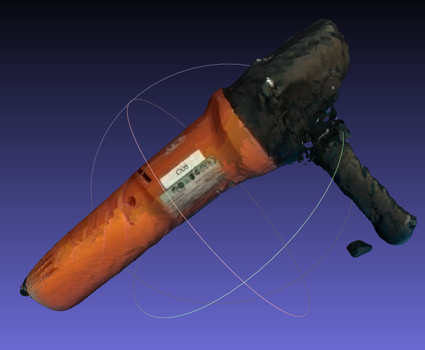

# FoundationPoseROS2: Multi-Object Pose Estimation and Tracking of Novel Objects in ROS2 with RealSense2

A Fork from the [FoundationPoseROS2](https://github.com/ammar-n-abbas/FoundationPoseROS2.git) adding [HaMer](https://github.com/geopavlakos/hamer.git) and [manotorch](https://github.com/lixiny/manotorch.git) for hand mesh recovery.

This aims to recover hand object interaction with existing repos.

  

## New features
We prepared several helper functions in `tool_new_obj`, where you may record camera data with ROS2 `tool_new_obj/ros_data_recoder.py`, run segmentation with SAM2 to prepare masks `tool_new_obj/segment_object.py` and reconstruct object using BundleSDF `tool_new_obj/run_bundlesdf.sh`

  
  

## Prerequisites
Please check README.md from [FoundationPoseROS2](https://github.com/ammar-n-abbas/FoundationPoseROS2.git). 
Additionally, we tested with `torch==2.4.1 torchvision==0.19.1`, which is compatible with HaMer in Python 3.10.

## Dependencies
Please check README.md from [FoundationPoseROS2](https://github.com/ammar-n-abbas/FoundationPoseROS2.git). 

## Get started
Simply using `build_all_conda.sh` may start working, but the run may fail due to the C++ issue from `/FoundationPose/bundlesdf/mycuda/` (see [FoundationPoseROS2](https://github.com/ammar-n-abbas/FoundationPoseROS2.git)). So simply follow the fix and rerun will solve it.

In addition, please pay attention that you also need to finish the yellow notifications at the end after running it. 

After that run `run_fp2.sh` may start the ROS2 node similar to [FoundationPoseROS2](https://github.com/ammar-n-abbas/FoundationPoseROS2.git). We provide an example using Femto Bolt camera. We assume a naive change of the camera topic name may adapt to other cameras.

